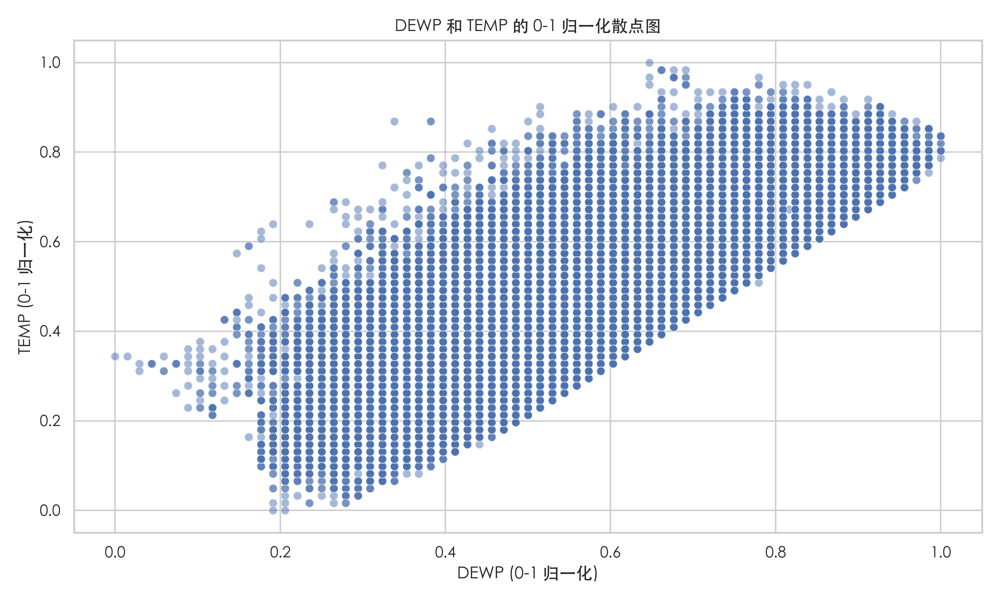
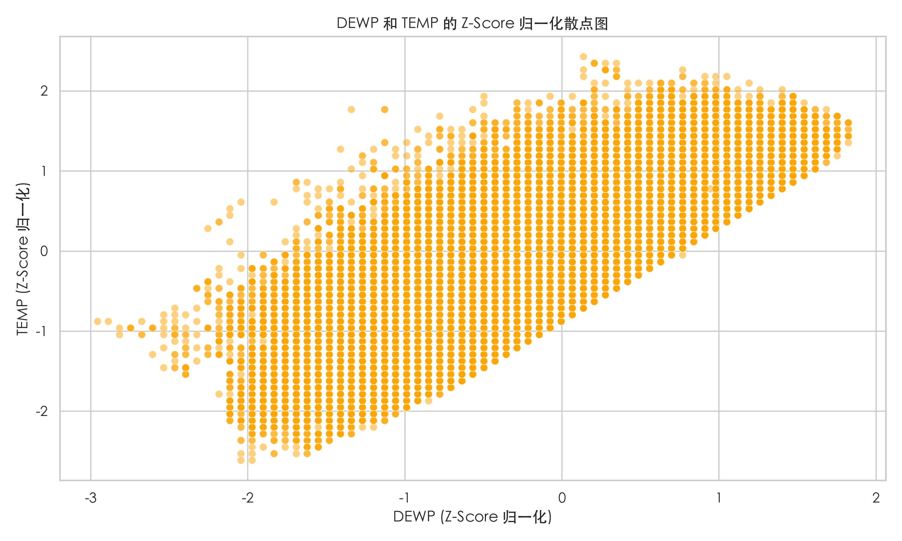
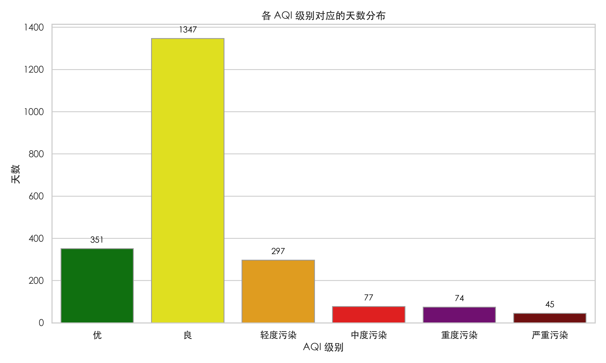

# Beijing PM2.5 Data Process

项目已开源至 [Github](https://github.com/Word2VecT/Beijing-PM2.5-Data-Process)

## 使用库

- `pandas` 2.2.3

- `matplotlib` 3.9.3

- `seaborn` 0.13.2

- `numpy` 2.1.3

## 快速开始

1. 克隆本项目到本地

    ```git
    git clone https://github.com/Word2VecT/Beijing-PM2.5-Data-Process
    cd Beijing-PM2.5-Data-Process
    ```

2. 安装 `uv` Python 项目管理器（需要 Python 环境以及 `pip`）

    ```bash
    pip install uv
    ```

3. 使用 `uv` 安装虚拟环境

    ```bash
    uv venv
    ```

4. 根据提示,激活虚拟环境 (以 `fish` 为例)

    ```bash
    source .venv/bin/activate.fish
    ```

5. 安装项目依赖

    ```bash
    uv pip install -r pyproject.toml
    ```

6. 进入 `code` 文件夹，运行你想预处理操作的 `python` code

    ```bash
    cd code
    python preprocessing_3SD.py
    ```

7. 导出文件生成在主文件夹，Enjoy!

## 处理结果

### 线性插值处理

> 对 `HUMI`、`PRES`、`TEMP` 三列，进行线性插值处理。并对其中超过 3 倍标准差的高度异常数据，修改为 3 倍标准差的数值。

- 处理 code：[`preprocessing_3SD.py`](code/preprocessing_3SD.py)

- 处理后 csv 数据文件：[`BeijingPM20100101_20151231_processed_3SD.csv`](BeijingPM20100101_20151231_processed_3SD.csv)

## 异常值处理

> 假设 PM 指数最高为 500，对 `PM_Dongsi`、`PM_Dongsihuan`、`PM_Nongzhanguan` 三列中超过 500 的数据，修改为 500PM 指数，进行异常值的处理。

- 处理 code：[`preprocessing_500PMmax.py`](code/preprocessing_500PMmax.py)

- 处理后 csv 数据文件：[`BeijingPM20100101_20151231_processed_500PMmax.csv`](BeijingPM20100101_20151231_processed_500PMmax.csv)

## 数据填充处理

> 修改 `cbwd` 列中值为 `cv` 的单元格，其值用后项数据填充。

- 处理 code：[`preprocessing_cv.py`](code/preprocessing_cv.py)

- 处理后 csv 数据文件：[`BeijingPM20100101_20151231_processed_cv.csv`](BeijingPM20100101_20151231_processed_cv.csv)

## 散点图表示

> 对 `DEWP` 和 `TEMP` 两列，进行 0-1 归一化及 Z-Score 归一化处理。 结果使用散点图的形式表示。

- 处理 code：[`normalization.py`](code/normalization.py)

- 处理后 csv 数据文件：[`BeijingPM20100101_20151231_DEWP_TEMP_Normalized.csv`](BeijingPM20100101_20151231_DEWP_TEMP_Normalized.csv)





### 空气质量数据离散化

> 将北京的空气质量数据进行离散化，按照空气质量指数分级标准，计算出每个级别（或颜色值）对应的天数各有多少

采用 PM 数据的平均值作为 AQI 的代表。实际 AQI 计算可能涉及更多污染物和复杂的计算方法，这里由于数据限制，只能进行简化。分类标准与[中华人民共和国国家环境保护标准](中华人民共和国国家环境保护标准)定义相同。

1. <span style="color:green;">0-50 优，绿色</span>

2. <span style="color:yellow;">51-100 良，黄色</span>

3. <span style="color:orange;">101-150 轻度污染，橙色</span>

4. <span style="color:red;">151-200 中度污染，红色</span>

5. <span style="color:purple;">201-300 重度污染，紫色</span>

6. <span style="color:brown;">300+ 严重污染，褐红色</span>

- 处理 code：[`get_AQI.py`](code/get_AQI.py)

- 计算结果输出 csv 文件：[`AQI_levels_counts.csv.csv`](AQI_levels_counts.csv.csv)


